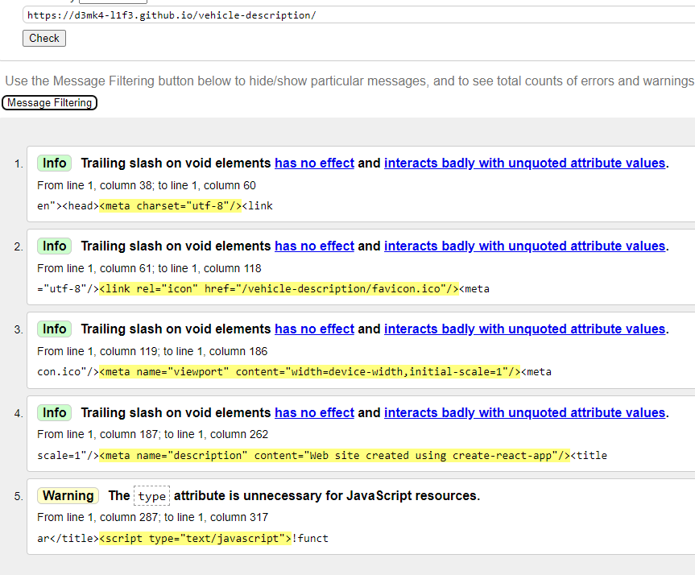

App for

# UaRentCar - Your Trusted Travel Companion 🚗

## Overview

Welcome to UaRentCar - Your Trusted Travel Companion. For seven years, UaRentCar
has been your go-to car rental service in Ukraine. We offer a diverse fleet,
impeccable customer service, and 24/7 technical support. Safety, convenience,
and sustainability are at the heart of our mission. Choose UaRentCar for
unforgettable journeys across Ukraine.

## Features

- **Diverse Fleet**: We offer a wide range of vehicles to suit your travel
  needs, from compact cars to spacious SUVs.

- **Impeccable Customer Service**: Our dedicated team is committed to providing
  you with the best service and support.

- **24/7 Technical Support**: We're here for you around the clock, ensuring a
  smooth and stress-free experience.

- **Safety First**: Your safety is our priority. Our vehicles are regularly
  maintained to the highest standards.

- **Convenience**: Easily book your rental online or through our app, making
  your travel arrangements hassle-free.

- **Sustainability**: We care for the environment. UaRentCar is dedicated to
  sustainable and eco-friendly practices.

## Getting Started

To get started with UaRentCar, simply visit our website at
(https://d3mk4-l1f3.github.io/vehicle-description/)

## License

This project is licensed under the XYZ License - see the some license file for
details.

## Contact Us

If you have any questions or need assistance, please reach out to our support
team at default@default.com.

Thank you for choosing UaRentCar - Your Trusted Travel Companion! 🚗

Some technical information:
Checked by w3validator
,
PageSpeed on desktop
,
PageSpeed on smaller platform starts from 320px of screen size

